# 내목소리번역기 VoiceProject

> 외국인 손님과 한국인 직원 사이의 주문 상황을 **STT -> 번역 -> 주문 슬롯 구조화 -> TTS/보이스클론**으로 연결하는 실시간 다국어 주문 보조 시스템입니다.

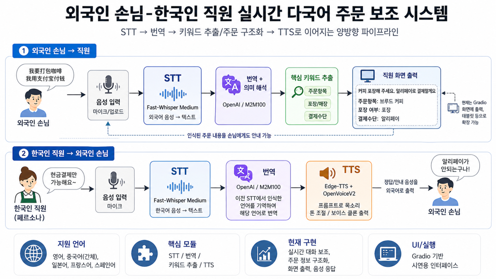

---

## 1. 프로젝트 소개

카페 현장에서는 커피 머신 소리, 배경 음악, 손에 묻은 물기, 주문 대기열 등으로 인해 번역 앱을 즉시 조작하기 어렵습니다. 특히 외국인 손님의 주문 옵션이 길어지면 메뉴명, 우유 변경, 얼음량, 당도, 포장 여부 같은 정보를 놓치기 쉽습니다.

이 프로젝트는 **1인 자영업 카페 또는 소규모 매장**을 대상으로, 외국어 주문을 한국어로 번역하고 핵심 주문 정보를 구조화해 직원 화면에 보여주는 시스템입니다. 반대로 직원의 한국어 응대는 손님 언어로 번역한 뒤 TTS와 보이스클론을 통해 음성으로 출력합니다.

### 핵심 목표

| 구분 | 목표 |
|---|---|
| 주문 이해 | 외국어 음성을 텍스트로 변환하고 한국어로 번역 |
| 주문 기억 | 메뉴, 옵션, 결제/포장 정보를 주문 슬롯으로 구조화 |
| 응대 표현 | 직역이 아닌 카페 상황에 맞는 자연스러운 표현 생성 |
| 브랜드 톤 | 사장님 목소리와 유사한 TTS로 일관된 응대 제공 |

---

## 2. 개발 기간

**2026.04.01 ~ 2026.04.30**

| 단계 | 기간 | 주요 작업 |
|---|---|---|
| 기획 | 04.01 ~ 04.15 | 문제 정의, 페르소나 설정, 고객 여정 지도 작성 |
| 모델 구축 | 04.16 ~ 04.23 | STT, 번역, TTS 모듈 구현 및 테스트 |
| 통합 개발 | 04.24 ~ 04.27 | Gradio UI, 손님/직원 모드, 주문 슬롯 연동 |
| 시각화/발표 | 04.28 ~ 04.30 | 성능 비교, 시연 화면 정리, README/발표자료 구성 |

---

## 3. 팀원 소개

| 팀명 | 이름 | 담당 영역 |
|---|---|---|
| 봄동조 | 박시영 | 프로젝트 기획 및 발표 자료 구성 |
| 봄동조 | 문하현 | 서비스 흐름 정리 및 시연 자료 구성 |
| 봄동조 | 박언희 | 페르소나/고객 여정 및 문제 정의 |
| 봄동조 | 정재승 | STT·번역·TTS 파이프라인 구현 및 GitHub 정리 |

---

## 4. 문제 정의와 해결 방법

### Persona

**황순심 / 54세 / 카페 사장**

- 안산 다문화거리 인근에서 카페 운영
- 에스프레소 머신, 배경음악, 매장 소음 때문에 외국어 주문을 놓치는 상황 발생
- 손에 물기가 묻어 있어 번역 앱을 바로 조작하기 어려움
- 외국어 가능 알바를 구하기 어렵고, 알바가 바뀔 때마다 서비스 품질이 흔들림

### Problem & Solution

| 문제 | 해결 방식 | 구현 기능 |
|---|---|---|
| 복잡한 커스텀 옵션을 기억하기 어려움 | STT + 주문 슬롯 | 메뉴, 우유, 얼음, 시럽, 포장 여부 추출 |
| 주문 의도를 오해함 | 맥락 기반 번역 | OpenAI 번역 + M2M100 fallback |
| 거절 표현이 어색하게 번역됨 | 카페 응대 프롬프트 | 정중하고 자연스러운 외국어 응대 생성 |
| 기계음이 딱딱함 | TTS + Voice Cloning | edge-tts + OpenVoiceV2 기반 음성 출력 |
| 알바 교체 시 응대 품질이 달라짐 | 내 목소리 번역기 | 사장님 톤을 반영한 일관된 응대 |

### Customer Journey

| Before | After |
|---|---|
| 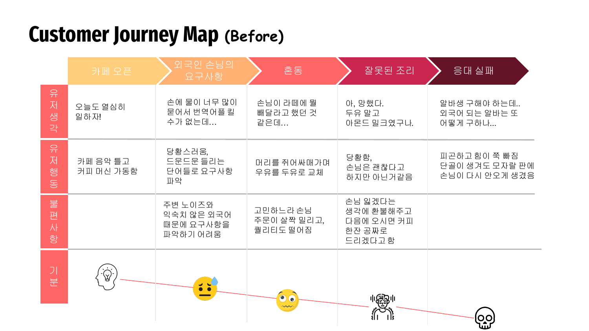 | 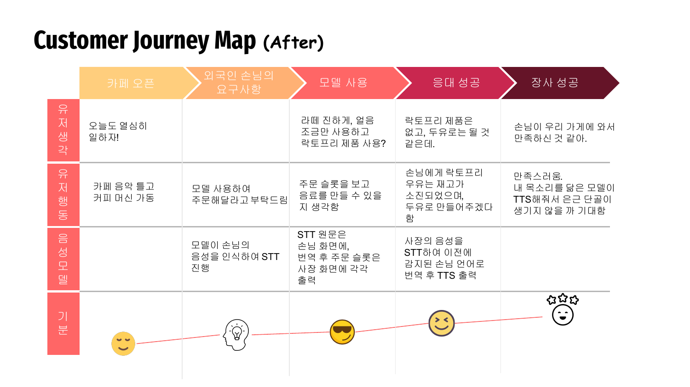 |

---

## 5. 주요 기능

### 5.1 손님 모드: 외국어 음성 -> 한국어 번역 + 주문 슬롯

외국인 손님의 음성을 업로드하거나 녹음하면, 선택한 언어를 기준으로 STT를 수행하고 한국어 번역과 주문 슬롯을 화면에 출력합니다.

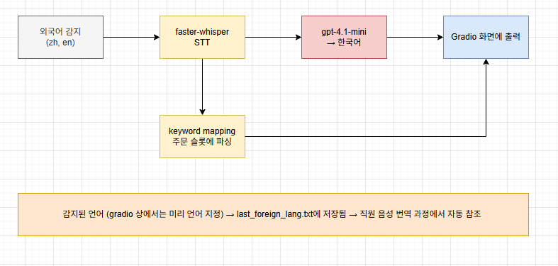

| 입력 | 처리 | 출력 |
|---|---|---|
| 영어/중국어 음성 | faster-whisper STT | 원문 텍스트 |
| STT 텍스트 | OpenAI / M2M100 번역 | 한국어 번역 |
| 주문 문장 | keyword_mapper | 주문 슬롯 JSON/화면 출력 |

### 5.2 직원 모드: 한국어 음성 -> 손님 언어 TTS

직원의 한국어 답변을 STT로 인식한 뒤, 직전에 손님이 선택한 언어로 번역하고 TTS 음성으로 출력합니다.

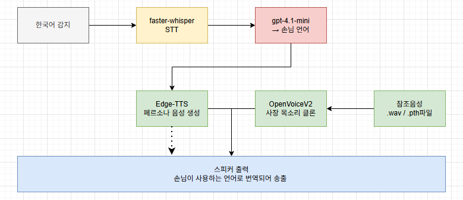

| 입력 | 처리 | 출력 |
|---|---|---|
| 한국어 직원 음성 | faster-whisper STT | 한국어 텍스트 |
| 한국어 텍스트 | OpenAI / M2M100 번역 | 영어/중국어 번역 |
| 번역 텍스트 | edge-tts + OpenVoiceV2 | 손님 언어 음성 |

### 5.3 주문 슬롯 추출

`keyword_mapper.py`는 카페 주문 문장에서 핵심 정보를 추출합니다.

```json
{
  "음료": "아메리카노",
  "온도": "아이스",
  "샷": "샷 추가",
  "시럽": "시럽 제외"
}
```

추출 대상 예시:

- 메뉴: 아메리카노, 라떼, 모카, 카라멜 마키아토 등
- 옵션: 온도, 사이즈, 샷, 시럽, 우유, 얼음량, 디카페인
- 보조정보: 포장/매장, 영수증, 빨대, 뚜껑, 봉투, 결제수단

---

## 6. 기술 스택

| 구분 | 기술 |
|---|---|
| Language | Python |
| UI | Gradio |
| STT | faster-whisper-medium |
| Translation | OpenAI GPT-4.1-mini, facebook/m2m100_418M |
| TTS | edge-tts |
| Voice Cloning | OpenVoiceV2 |
| Audio Processing | pydub, FFmpeg |
| AI Framework | PyTorch, Transformers |
| Config/Data | JSON, Regex keyword mapping |
| Version Control | Git, GitHub |

---

## 7. 시스템 구조

### 전체 파이프라인

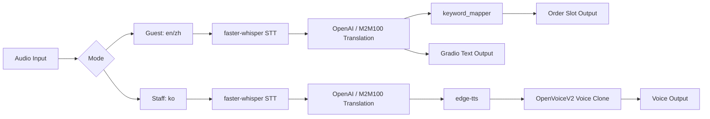

### 모드별 흐름

| 손님 모드 | 직원 모드 |
|---|---|
| 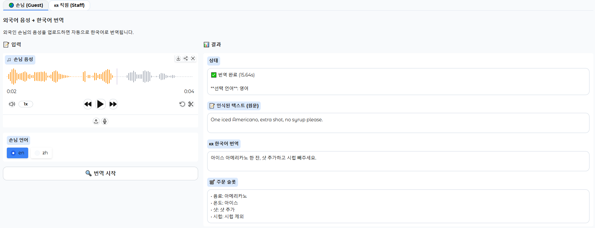 | 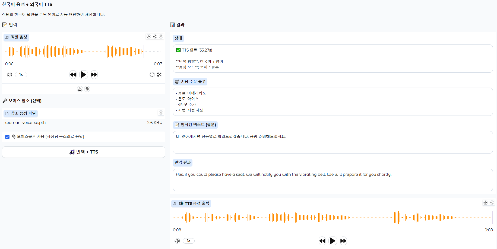 |

---

## 8. 실행 화면

### 8.1 손님 모드 시연

| 영어 주문 | 중국어 주문 |
|---|---|
|  | 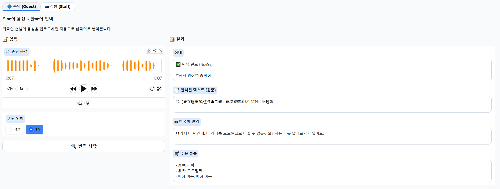 |

### 8.2 직원 모드 시연

| 한국어 -> 영어 TTS | 한국어 -> 중국어 TTS |
|---|---|
|  | 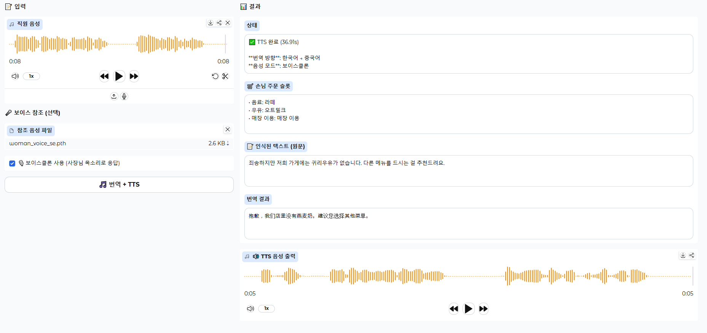 |

### 8.3 보이스클론 검증

| 스펙트로그램 비교 | 코사인 유사도 |
|---|---|
| 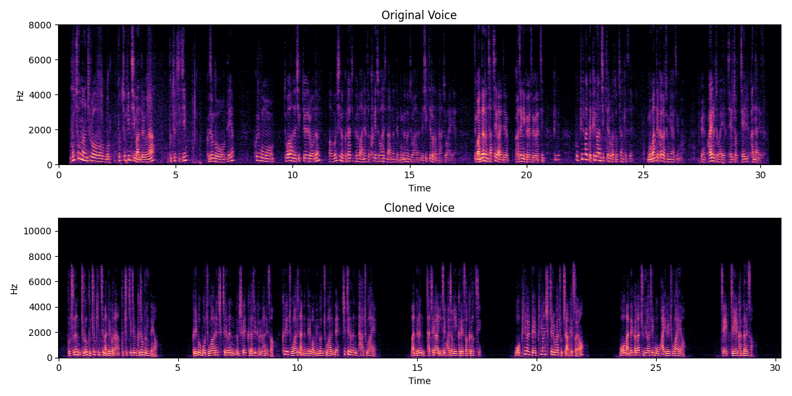 | 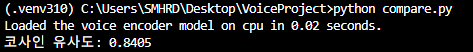 |

- 원본 음성과 클론 음성의 스펙트로그램 패턴을 비교했습니다.
- ECAPA 기반 voice encoder로 임베딩 유사도를 계산했습니다.
- 테스트 결과 코사인 유사도는 **0.8405**로 확인되었습니다.

---

## 9. 성능 비교

GPU 환경과 CPU 환경에서 주요 단계별 처리 시간을 비교했습니다.

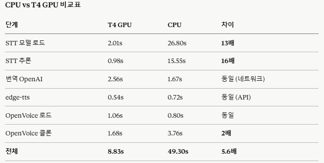

| 단계 | T4 GPU | CPU | 차이 |
|---|---:|---:|---:|
| STT 모델 로드 | 2.01s | 26.80s | 약 13배 |
| STT 추론 | 0.98s | 15.55s | 약 16배 |
| 번역 OpenAI | 2.56s | 1.67s | 네트워크/API 영향 |
| edge-tts | 0.54s | 0.72s | API 영향 |
| OpenVoice 로드 | 1.06s | 0.80s | 환경 차이 |
| OpenVoice 클론 | 1.68s | 3.76s | 약 2배 |
| **전체** | **8.83s** | **49.30s** | **약 5.6배** |

---

## 10. 폴더 구조

```text
VoiceProject/
├── app.py
├── download_models.py
├── extract_embedding.py
├── requirements.txt
├── requirements_tts.txt
├── setup.bat
├── create_folders.bat
├── run_pipeline.bat
├── stt_candidates.json
│
├── config/
│   └── cafe_keywords.json
│
├── scripts/
│   ├── stt.py
│   ├── smart_stt.py
│   ├── translate.py
│   ├── tts.py
│   ├── keyword_mapper.py
│   ├── mappingword.py
│   ├── mappingword_fn.py
│   ├── naturalize_en.py
│   └── rule_pattern.py
│
├── docs/
│   └── images/
│
├── models/              # GitHub 업로드 제외
├── reference_voices/    # GitHub 업로드 제외
├── output/              # GitHub 업로드 제외
└── logs/                # GitHub 업로드 제외
```

---

## 11. 실행 방법

### 11.1 환경 준비

```powershell
python -m venv .venv
.\.venv\Scripts\activate
pip install -r requirements.txt
```

TTS/OpenVoice 환경은 Python 버전 충돌을 줄이기 위해 별도 가상환경으로 분리합니다.

```powershell
python -m venv .venv310
.\.venv310\Scripts\activate
pip install -r requirements_tts.txt
```

### 11.2 환경변수 설정

프로젝트 루트에 `.env` 파일을 만들고 아래처럼 작성합니다.

```env
OPENAI_API_KEY=YOUR_OPENAI_API_KEY
```

> `.env`, 모델 파일, 음성 파일, 결과 파일은 GitHub에 올리지 않습니다.

### 11.3 모델 다운로드

```powershell
.\.venv\Scripts\activate
python download_models.py --all
huggingface-cli download Systran/faster-whisper-medium --local-dir models\whisper
```

OpenVoiceV2 체크포인트는 아래 경로에 배치합니다.

```text
models/openvoice/checkpoints_v2/converter/
```

### 11.4 Gradio 앱 실행

```powershell
.\.venv\Scripts\activate
python app.py
```

실행 후 브라우저에서 접속합니다.

```text
http://127.0.0.1:7860
```

---

## 12. 주요 코드 설명

### `app.py`

Gradio UI와 전체 파이프라인을 연결하는 메인 파일입니다.

- 손님 탭: 외국어 음성 -> 한국어 번역 -> 주문 슬롯 출력
- 직원 탭: 한국어 음성 -> 외국어 번역 -> TTS 출력
- warmup: STT, 번역, OpenVoice 모델 사전 로드

### `scripts/stt.py`

faster-whisper 기반 STT 모듈입니다.

- base/tuned 모델 선택
- 언어 자동 감지 또는 언어 고정
- 카페 주문 맥락 prompt 적용
- STT 결과 JSON 저장

### `scripts/smart_stt.py`

프론트에서 선택한 언어를 기준으로 base/tuned 모델 결과를 비교하는 SMART STT 모듈입니다.

- 손님 언어 en/zh 고정
- beam size 기반 후보 비교
- 주문 키워드, 주문 슬롯, 문장 길이 등을 점수화
- 최종 best 결과만 화면 출력

### `scripts/translate.py`

STT 결과 JSON을 읽고 번역 방향을 자동 결정합니다.

- 외국어 -> 한국어
- 한국어 -> 직전 손님 언어
- OpenAI 우선, M2M100 fallback 구조

### `scripts/tts.py`

번역된 텍스트를 음성으로 변환합니다.

- edge-tts 기본 음성 생성
- OpenVoiceV2 보이스클론 적용
- `.wav` 참조 음성 또는 `.pth` 임베딩 사용

### `scripts/keyword_mapper.py`

정규식 기반 카페 주문 슬롯 파서입니다.

- 다국어 키워드 매핑
- 메뉴/옵션/결제/포장 정보 구조화
- 직원 응답 문장 필터링
- Apple Pay / apple pie 등 문맥 오인식 보정

---

## 13. Trouble Shooting

| 문제 | 원인 | 해결 방법 |
|---|---|---|
| `ffprobe` 또는 `ffmpeg` 오류 | FFmpeg 경로 미설정 | `C:\ffmpeg\bin` 설치 후 PATH 등록 |
| OpenAI 번역 실패 | API 키 없음 또는 `.env` 미로드 | `.env`에 `OPENAI_API_KEY` 설정 |
| OpenVoice import 실패 | TTS 환경 패키지 충돌 | `.venv310`에서 TTS 실행 |
| STT 속도 느림 | CPU 실행 | CUDA/PyTorch GPU 환경 확인 |
| 이전 번역 결과가 TTS에 사용됨 | output 폴더의 오래된 JSON 참조 | `clear_session.bat` 또는 output 정리 |
| 모델 폴더 없음 | GitHub에는 모델 미포함 | `download_models.py`와 HuggingFace CLI로 다운로드 |

---

## 14. 프로젝트 회고

이번 프로젝트는 단순 번역 앱이 아니라, 실제 카페 주문 상황에서 발생하는 **소음, 기억, 표현, 서비스 톤** 문제를 함께 해결하는 방향으로 설계했습니다. 특히 STT 결과를 그대로 번역하는 데서 끝내지 않고, 주문 슬롯을 구조화해 직원이 바로 확인할 수 있도록 만든 점이 핵심입니다.

개발 과정에서 가장 어려웠던 부분은 STT 오인식과 번역 품질의 편차였습니다. 이를 해결하기 위해 카페 도메인 keyword mapping, 직원 응답 필터링, OpenAI 기반 자연어 번역, M2M100 fallback을 조합했습니다. 또한 TTS는 단순 음성 출력에 그치지 않고 OpenVoiceV2 기반 보이스클론을 결합해 매장의 브랜드 톤을 유지하는 방향으로 확장했습니다.

### 개선 방향

- 손님 언어를 영어/중국어 외 일본어, 프랑스어, 스페인어까지 확장
- 주문 슬롯 결과를 POS/주문서 형태로 저장
- 모바일/태블릿 화면에 최적화된 UI 개선
- 실제 매장 소음 데이터 기반 STT 성능 재검증
- 보이스클론 품질 평가 지표 고도화

---

## 15. 라이선스 및 주의사항

- 본 프로젝트는 교육 목적의 프로토타입입니다.
- API Key, 모델 파일, 음성 원본, 로그, 출력 결과는 저장소에 업로드하지 않습니다.
- 보이스클론 기능은 반드시 본인 또는 사용 허가를 받은 음성만 사용해야 합니다.
